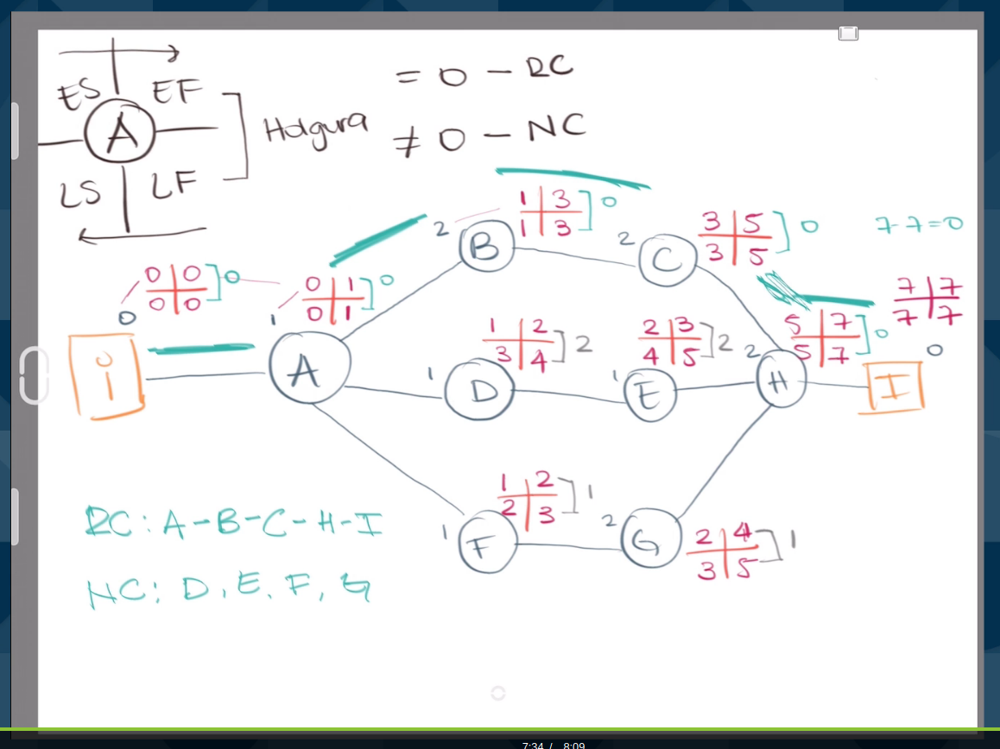

# FundamentosGestionProyectos
Fundamentos de la Gestión de Proyectos Por Isabella Arévalo

## Qué es un proyecto?
### Un proyecto es un esfuerzo temporal que se lleva a cabo para crear un producto, servicio o resultado único
Tiene un principio y fin definido, no importa si es por etapas, todas tienen incio y fin. Debe tener un resultado único.

## Quién gestiona el proyecto? 
El gestor, coordinador, gestor, director. Es el encargado de dirigir, gestionar y controlar desde el inicio hasta el fin del proyecto. 

## Elmentos de proyecto. 
- Finalidad y Objetivo
  Suelen estar relacionados con el resultados y los objetivos. La finalidad es el ¿Por qué? y el objetivo es el ¿Cómo? 
- Beneficiarios
  Los que reciben los beneficios del proyecto.
- Producto o servicio
  Elemento central del proyecto. No es el resultado. El proyecto puede ser aumentar los sucriptores. Aumentar los contenidos es parte del producto. Un micro proyecto es cada uno de los contenidos.
- Actividades
  Todo proyecto tiene actividades, no hay un número standar. Depende del tamaño. 
- Calendario / Cronograma
  Fechas y plazos, pueden incluir costos y responsables de las actividades. 
- Recursos Diponibles
  Todo con lo que contamos, Finanzas, personas, espacio físico. 
- Presupuesto
  Muy conciso y meticuloso. 
- Resultados
  Lo que queremos alcanzar una vez que hemos cumplido, se vincula con la finalidad y los objetivos
  
## Tipos de proyectos 
No existen dos proyectos iguales. Es necesario "tropicalizar"
### Según su complejidad
- Sencillos: 
  Sencillos pocas actividades
- Complejos: 
  Muchas actividades, mayor planificación
### Según la procedencia del Capital
- Públicos
  Fondos del gobierno
- Privados
  Fondos de organizaciones copn fines de lucro o capital privado
- Mixtos
  Fondos públicos y privados
### Según el ambito
Medicos, tecnológicos, acádemicos, etc
### Según su orientación 
- Sociales
  Mejorar la calidad de vida
- Comunitarios
  La comunidad es la que busca mejorar su calidad de vida
- Investigación 
  Ciencia, medicina, educación
- Personales o de vida
  Puede ser mezclando muchos de los anteriores, en este caso somos los beneficiarios. 
### Según el tamaño 
Se determinan según: 
  - Capital de inversión
  - Número de trabajadores
  - ventas (proyectadas)
## Pequeña
Construir una página web
Asistir a una competencia regional de cierta disciplina 
## Mediana 
Contruir una escuela 
Remodelar el parque de la escuela
## Gran Escala
Construir Centro Comercial 
Recaudación de fondos tipo teletón

## Qué hace un proyecto exitoso
Ningun proyecto es igual, pueden tener muchas cosas parecidas pero no igual. 
1. Elegir bien el equipo de trabajo - Gente profecional y bien preparada.
2. Metas claras. 
3. Planificación detallada, muy detallada.
4. Aprender a comunicar 
5. Gestión de riesgos

## Por qué fracasan los proyectos
- falta de documentación y seguimiento adecuado - plan de seguimiento y control
- Estimación inadecuada de los costos
- Desalineación cultural y/o ética

## Relación entre Proyecto, programa, Portafolio
-. Proyecto: Un proyecto es un esfuerzo temporal que se lleva a cabo para crear un producto, servicio o resultado único
-. Programa: Conjunto de proyectos que guardan cierta relación entre sí. Puede ser secuenciales, paralelos o interdependientes. 
-. Portafolio: Nivel superior de gestion de programas y proyectos que buscan alcanzar los objetivos estrategicos del negocio/fundación. 

## Ciclo de vida de un proyecto 
Son las faces por las que pasa el proyecto. 
1. Iniciación
  Se estudia la factibilidad del proyecto y estimación de tiempos. Si es viable se continua en las siguientes fases.
    Se haces don documentos: 
    1. Documentos del Caso: La justificación de la necesidad del proyecto y los beneficios. 
    2. Estudio de factibilidad: evaluar las metas, cronogramas y costos 
2. Planificación
  Planificación, cada uno de los pasos y actividades, costos, tiempos y correspondientes. Se planifica el seguimiento y control así como su frecuencia.
3. Ejecución
  Se pone en marcha el paso 1 y 2 y el proyecto ya tiene vida. 
4. Seguimiento y control
  Suele ir combinado con la ejecución, la idea es corregir lo necesario, es necesario planificar esto y quienes les dan seguimiento y la forma de reporte. 
5. Cierre
  Al entregar los resultados al cliente y comunicacdo a todas las partes. Es importante para liberar los recursos. 
**Muy importante documentar las lecciones aprendidas**

## Cómo se dirige un proyecto? La importancia del liderazgo 
Cuál es la diferencia de estos tres perfiles: 
-. Gestor de proyecto 
  El encargado/a del desarrollo del proyecto 
  Competencias: 
  **Conocimeinto:** pleno del proyecto, de inicio a fin. Documentación, proveedores, interesados. 
  **Desempeño:** la aplicación de los conocimientos
  **Personales:** comportamiento cuando se ejecutan las actividades del proyecto
  **Interpersonales:** trabajo en equipo, motivación, comunicación, influencia, toma de decisiones, negoción, generación de confianza, gestión de conflictos, proporcionar orientación. 
-. Gerente de operaciones
  Libera fondos, maquinaria, archivos
-. Gerente General 
  Encargado de la operación completa de la compañia.

## Aspectos que fortalecen el liderazgo 
-. Escuchar 
-. Respeto 
-. Ser directo 
-. Adaptación 
-. Buena relación 

### ¿Qué hacer si el gestor no es bueno?
1. Crear una relación con esa persona. (buscar ser empatico)
2. Apreciar sus fortalezas.
3. Añadir valor.

## Quiénes integran un proyecto? 
Los proyectos cambian y los roles las constantes son: 
-. Personal de dirección del proyecto.
-. Personal del proyecto (ejecución)
-. Expertos (legales, ambientales, etc) 
-. Representantes del cliente. 
-. Vendedores

Es importante contar con un plan de gestion de recursos humanos
### Plan de gestion de recursos humanos
Es la guía para definir, adquirir, dirigir y liberar los recursos humanos del proyecto.
-. Roles: la función asumida/asignada a una personal en el proyecto 
-. Responsabilidades: tareas asignadas y el trabajo que se espera realice. 
-. Autoridad: firmas, uso de recursos, decisiones, aprobaciones, entregables, todos llevan cierto nivel de autoridad, no todos pueden hacer todo. 
-. Competencia: habilidad y capacidad requerido para completar las actividades
-. Organigrama: representación gráfioca de los mientros del equipo del proyecto, sus relaciones y como se comunican. 
-. Plan de gestión del personal: parte del plan de recursos humanos, describe cómo y cuándo se incorporan miembros al proyecto. 
  -. adquisición del personal: ¿Cómo? nosotros lo buscamos, nos lo proveen
  -. calendario: días labores, horarios, fechas de descanso, cuándo se realiza cada parte del proyecto
  -. liberación del personal: cuándo se libera al personal y cómo es el proceso. 
  -. necesidades de capacitación: aún a los expertos, es necesario en ciertas áres. 
  -. recompensas y reconocimientos: según cirterios claros y establecidos. 
  -. Políticas y procedimientos que protegen a los miembros del equipo frente a los peligros relacionados. ¿Qué hacemos para asegurar las vidas del personal? 

## Alcance de un proyecto 
Qué se incluye y lo qué no. Es tanto el alcance del producto (caracteristicas y funciones que describen un producto) como del proyecto (es el trabajo realizado para entregar el producto).

### Qué debe incluir:
-. Qué es, por qué está sucediendo y qué logrará 
-. Quién lo aprueba 
-. Cómo se completarpa (enfoque, fases y tareas)
-. Qué se producirá
-. Cuándo se entregará
-. Cuánto costará
-. Qué esta incluido y qué no (restricciones)

Este enunciado del alcance es parte de lo ultimo que se redacta pues, es necesario tener la estimación de costos, cronograma y gestión del personal. 

## Qué es un EDT y cómo se hace
**Estructura de desglose del trabajo** es una descomposición jerárquica orientada al producto entregable. Las actividades y pequeños entregables. 
**Se utiliza para:**
-. Definir el alcance en terminos de entregables
-. Definir los ciclos de los procesos 
-. Dotar al equipo co un marco de referencia 
-. Elemento clave
**Cómo está estructurada**
-. Orientada a entregables, programación y/o recursos
**Pasos:**
-. Identificar el entregable final del proyecto. 
-. Indentificar esa serie de entregables pequeños que dan forma (los principales)
-. Despocomponer los niveles de entregables. Los más pequeños son paquetes de trabajo (las acciones concretas) 
-. Revisar y refinar la EDT con los involucrados del proyecto hasta llevar a un acuerdo. 

**Es necesrio crear el diccionario del EDT**
-. Explicación de los terminos tecnicos. 
-. Aún los textos no tecnicos pero de refencia propia del proyecto.

Documentos de caso y Estudio de Factibilidad - Documentos que debieran ser desarrollados usando design thinking. 
El primero busca entender y establecer el problema y la solución planteada. 
El segundo busca medi las probabilidades de éxito y/o fracaso según los resultados proyectados. 
Ambos documentos se hacen usalmente al mismo tiempo y en el proceso de planificación. 

## Gestión del tiempo
El cronograma debe ser realista e iterativo es normal agregar o acortar el tiempo pero debe ser muy mínimo 
Debe determinarse el mejor plazo/calendario 

## Cómo se estiman
-. determinar el tiempo de cada una de las actividades
-. se puede consultar con el encargado de la actividad
-. actividades según el EDT 
-. Secuencias actividades (o simultaneas) 

### Relaciones entre actividades
-. Final Inicio 
-. Inicio Inicio
-. Final Final
-. Inicio Final

## Tipos de cronogramas
Es la herramienta de planificación que determina el inicio y fin de todo. 
**Qué debe contener el cronograma:**
-. Tareas: acitivades realizadas en secuencial .
-. Trabajo: esfuerzo para hacer la tarea.
-. Hitos: Identifica los hechos más relevantes para determinar el final de una fase importante. 
-. Duración: tiempo que se tarde una tarea. 
-. Responsable: ¿Quién hace qué? ¿Quién supervisa? 
-. Costo: elemento opcional. 

**Tipos de cronogramas:**
-. Gantt: Tiempo en x y Actividades en Y 
-. Pert: Secuenciales
-. Cronograma de trabajo: Y actividades X tiempo Y al final Responsable 
  
## Gestionar y desarrollar un cronograma
## Rura Critica 
Es el control de ciertas actividades indiscutibles para cumplir. 
Critical Path Method 
**Beneficios:**
-. Priorizar lo importante.
-. Identificar lo que no es crítico.
-. Nos ayuda a tomar desiciónes.
**Pasos**
.- Definir actividades
-. Establecer relaciones
-. realizar el calculo en red**
-. definir la ruta critica

** cada actividad se identifica con una letra, cada letra es el hito como tal. 
Cada actividad es represetada en el Cronograma de perl y tiene 4 cuadrantes, early estar earli finish en la parte superior y en la parte inferior, late star y late finish 
La resta del inferior menos el superior ontenemos la holgura ya sea igual a 0 y es la ruta critica y cuando no es cero no es critico. 

El early star es de izquierda a derecha y el late es de derecha a izquierda

## Recursos y Costos
**Recursos:** todo lo que tenemos, desde lo material hasta los humanos. También intelecutales y financieros. 
**Estimación de costos** Proceso para estimar costos. 
-. Plan de gestión de costos.
-. Estimar costos (Cotizaciones).
-. Determinar presupuesto. 
-. Controlar los costos. 
Tipos de costos: 
**Según la relación:**
Directos: todo lo que afecta la ejecución 
Indirectos: pagos de los que se pueden precindir sin afectar el proyecto. 
**Según origen:**
Internos: Producidos por actividades desarrolladas con recursos propios.
Externos: desarrollados por terceras partes. 

## Tipos de estimación 
**Análoga:** Utiliza el costo real de otro proyecto similar que ya fue ejecutado. O Rangos conocidos.  
**Paramétrica** Utiliza la relación estadística con datos historicos y otras variables para estimar r
**Asendente** Para un trabajo específico. Y luego se multiplica por el total de "trabajos".
**3 valores**Se consideran riesgo e incertidumbre
  - Más probable: casi seguro.
  - Optimista: el mejor precio.
  - Pesimista: lo más caro. 
**Oferta de proveedores** Cotizaciones.

Presupuesto: la sumatoria del costo de todas las actividades. 
Siempre es importante la consulta a expertos. 
**Conciliación del límite de financiamiento** Usualmente en proyectos de ONG. 

## Control de riesgos
**Riesgo:** Evento o condición incierta que de producirse tiene un efecto en los objetivos del proyecto. 
**Gestión de riesgos:** Aunmentar la probabilidad e impacto de lo positivo sobre lo negativo. 
**Qué inclye el Plan**
  - Metodología: ¿Cómo lo vamos a gestionar?.
  - Roles y responsabilidades: QUién lidera la gestión.
  - presupuesto: Cuánto vamos a asignar al riesgo.
  - Calendario: Cuándo y con qué frecuencia se evaluan los riesgos. 
  - Por categorias: Técnicas (maquinaria), Externas(carreteras, amnifestaciones), de la organización(personal), dirección de proyectos(UNa segunda voz al mando). 

### Cómo identificar?
  - Revisión periodica: de la propuesta. 
  - Lluvia de ideas: periodica en la revisión de riesgos. 
  - Delphi: encuesta a expertos y resumen a ellos de sus comentarios sale la información valisoa. 
  - Análisis de causa raíz: Análisis del arbol. 
  - Lista de verificación: revisamos 
  - Análisis de supuestos: escenarios hipoteticos. 
  - FODA.

## Gestión de Cambios
Todo es por escrito. Sin documentos que respalden no se gestión cambios. 
  - Acciones correctivas: busca corregir el rumbo y seguir el plan.
  - Acciones preventivas: identificar erroes antes de que sucedan.
  - Reparación de defectos: modificar o componer.
  - Actualizaciones: cambios en los elementos formalmente controlados.

**Control de cambios** tipo Git. Puede tomarse la decisión por una persona o un board. 

inicio Planificación ejecución seguimiento control y cierre

## Cierre de proyectos
Técnica: ya terminaos y no tenenmos entregables pendientes.
Administrativo: todo el presupuesto ha sido asignado. Salvo el de mitigación de riesgos. 
Es necesaria el acta de cierre: 
  - Nombre del proyecto
  - Cliente
  - Fecha de recepción (del documento) 
  - Estado del proyecto 
  - Detalle de los elementos entregados (es el reflejo de lo planificado) 
  - Firmas

